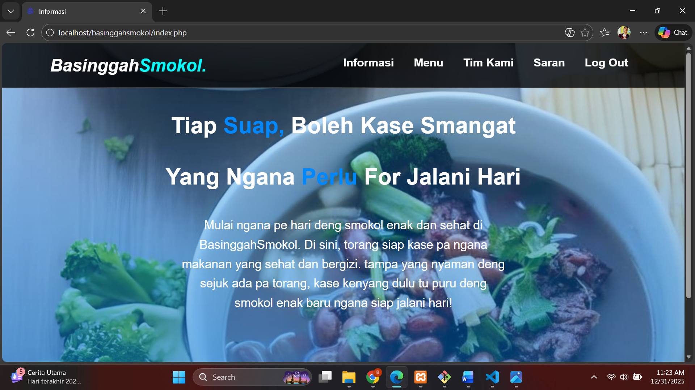
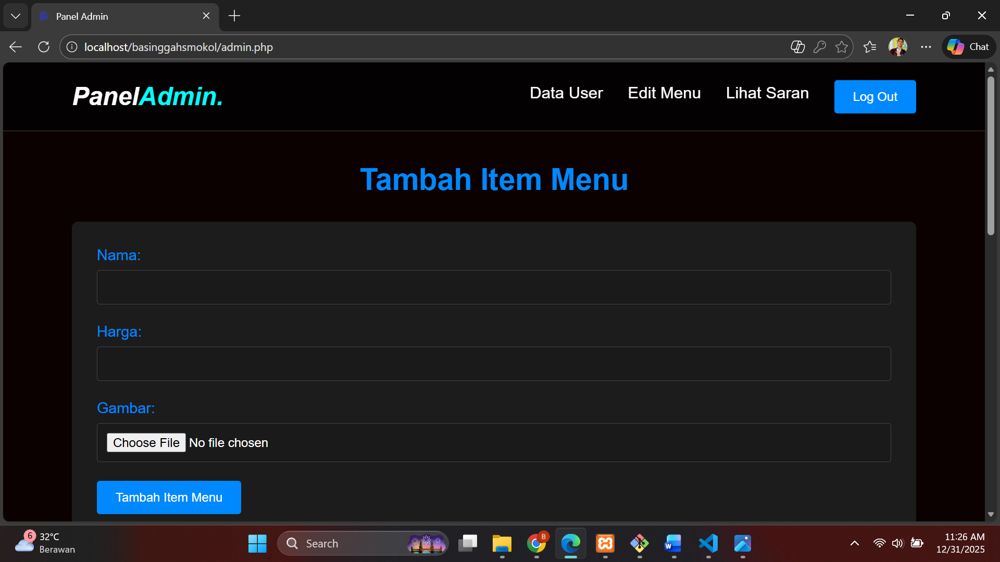

# 🍽️ BasinggahSmokol — Sistem Informasi Rumah Makan

BasinggahSmokol adalah website sistem informasi rumah makan yang menyediakan menu makanan khas Manado (khusus sarapan) dengan dukungan fitur manajemen menu, autentikasi pengguna, serta pengelolaan saran pelanggan.  

Proyek ini dikembangkan sebagai tugas akhir mata kuliah **Pemrograman Web — Semester 4**  
Program Studi **Teknik Informatika – Universitas Sam Ratulangi**.

---

## 🎯 Tujuan Pengembangan

- 🌐 Menyediakan informasi rumah makan & menu secara online  
- ⚙️ Memberikan platform manajemen menu berbasis web untuk Admin  
- 👥 Mempermudah interaksi pelanggan melalui fitur saran  
- 🚀 Meningkatkan efisiensi operasional rumah makan  

---

## 🚀 Fitur Utama

✔️ **Mekanisme Login & Registrasi**
- Hak akses **Admin** & **User**
- Validasi akun

✔️ **Halaman Informasi Umum**
- Deskripsi usaha
- Lokasi & kontak

✔️ **Daftar Menu Makanan & Minuman**
- Nama menu  
- Harga  
- Gambar menu  

✔️ **Manajemen Konten (Admin)**
- ➕ Tambah Menu  
- ✏️ Edit Menu  
- 🗑️ Hapus Menu  

✔️ **Kelola Data User**

✔️ **Pengelolaan Saran Pelanggan**

✔️ **Halaman Tim / Anggota Kelompok**

> Semua data diambil secara dinamis dari database MySQL.

---

## 🧠 Peran Pengguna (User Roles)

### 👨‍🍳 Admin
- Login / Logout  
- Kelola daftar menu  
- Kelola data user  
- Melihat saran pelanggan  

### 👤 User
- Registrasi & login  
- Melihat informasi rumah makan  
- Melihat daftar menu  
- Mengirim saran  

---

## 🛠️ Teknologi yang Digunakan

- ⚙️ PHP
- 🗄️ MySQL
- 🎨 HTML, CSS, JavaScript
- 🌍 Hosting 000WebHost (deployment project)

---

## 🖼️ Tampilan Aplikasi

### 👤 Tampilan User


### 👨‍🍳 Tampilan Admin



---

## 📂 Struktur Proyek (Ringkas)

```text
/basinggahsmokol
 ├── asset/
 ├── admin/
 ├── css/
 ├── img/
 ├── php/
 ├── index.php
 ├── login.php
 ├── menu.php
 └── README.md
```

---

## 👥 Anggota Kelompok

Proyek dikerjakan oleh:

- SARMILA ADABAYE  
- NATHANAEL M. TUWAIDAN  
- BRANDO M. ZUSRIADI  
- SAVIO H. PALENDENG  

---

## 📌 Status Proyek

🟢 Selesai — Final Project Pemrograman Web  
🎯 Fokus: Implementasi CRUD, autentikasi, & pengelolaan konten berbasis database

---

## 🙏 Kredit & Apresiasi

Proyek ini dikembangkan sebagai:

- 💻 Implementasi pembelajaran pengembangan aplikasi web  
- 🤝 Latihan kerja sama tim (collaborative development)  
- 🧩 Penerapan konsep **dynamic website & database integration**

Program Studi  
**Teknik Informatika — Universitas Sam Ratulangi**

---

## 📜 Catatan Lisensi

Proyek ini dibuat untuk keperluan akademik dan pembelajaran.  
Penggunaan ulang disarankan mencantumkan atribusi yang sesuai.
